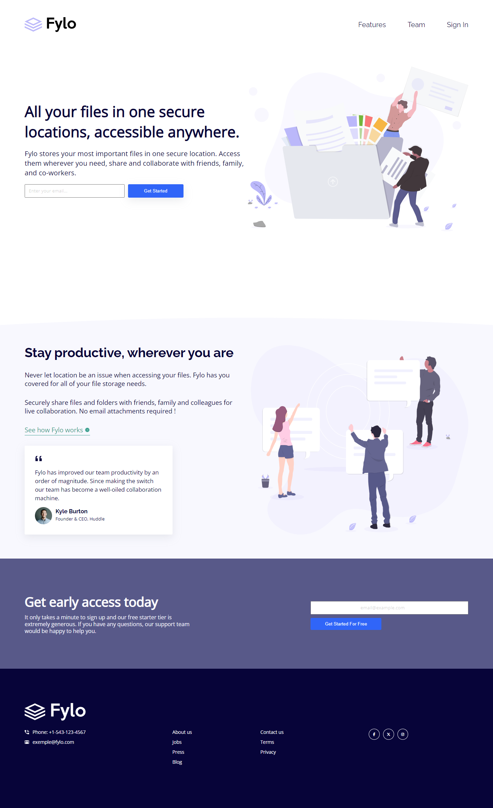

# Frontend Mentor - Fylo landing page with two column layout solution

This is a solution to
the [Fylo landing page with two column layout challenge on Frontend Mentor](https://www.frontendmentor.io/challenges/fylo-landing-page-with-two-column-layout-5ca5ef041e82137ec91a50f5).
Frontend Mentor challenges help you improve your coding skills by building realistic projects.

## Table of contents

- [Overview](#overview)
    - [The challenge](#the-challenge)
    - [Screenshot](#screenshot)
    - [Links](#links)
- [My process](#my-process)
    - [Built with](#built-with)
    - [What I learned](#what-i-learned)
    - [Useful resources](#useful-resources)
- [Author](#author)

## Overview

### The challenge

Users should be able to:

- View the optimal layout for the site depending on their device's screen size
- See hover states for all interactive elements on the page

### Screenshot



### Links

- Solution URL: [GitHub](https://github.com/CorentinTalour/Fylo-landing-page)
- Live Site URL: [GitHub.io](https://corentintalour.github.io/Fylo-landing-page/)

## My process

### Built with

- Semantic HTML5 markup
- SCSS
- Flexbox
- Mobile-first workflow
- Font Awesome

### What I learned

CSS clamp

```scss
.proud-of-this-css {
  font-size: clamp(0.8rem, 3vw, 2.5rem);
}
```

CSS min()

```css
.proud-of-this-css {
    margin: 0 min(8vw, 7rem) 0 min(8vw, 7rem);
}
```

### Useful resources

- [Example resource 1](https://www.frontendmentor.io/solutions/huddlelandingpagewithblocksmaster-using-web-components-XuK1WV1QJN) -
  This solution taught me a lot about responsiveness.
- [MDN Docs](https://developer.mozilla.org/en-US/)

## Author

- Frontend Mentor - [@CorentinTalour](https://www.frontendmentor.io/profile/CorentinTalour)
